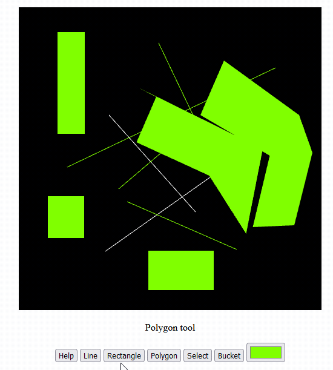

# Tubes1-Grafkom-IF3260
## How to Use
1. Untuk mengakhiri pembuatan polygon, anda dapat melakukan klik kanan atau menekan tombol Finalize Polygon

## Referensi
1. https://stackoverflow.com/questions/46768355/webgl-draw-2d-triangle-with-mouse-click
2. https://webglfundamentals.org/
3. https://webglfundamentals.org/webgl/lessons/webgl-drawing-multiple-things.html
4. https://webglfundamentals.org/webgl/lessons/webgl-picking.html
5. https://webglfundamentals.org/webgl/lessons/webgl-tips.html#tabindex